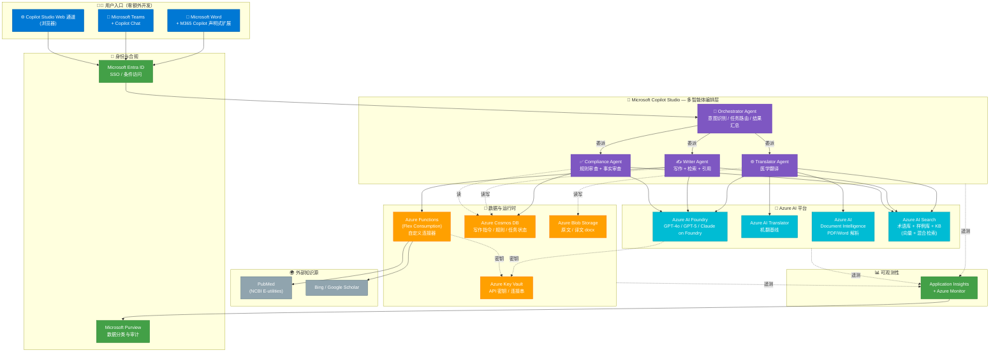
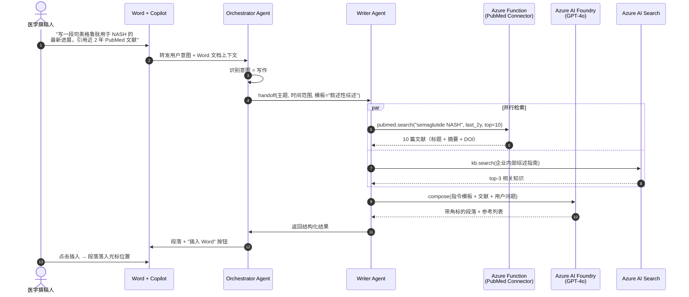
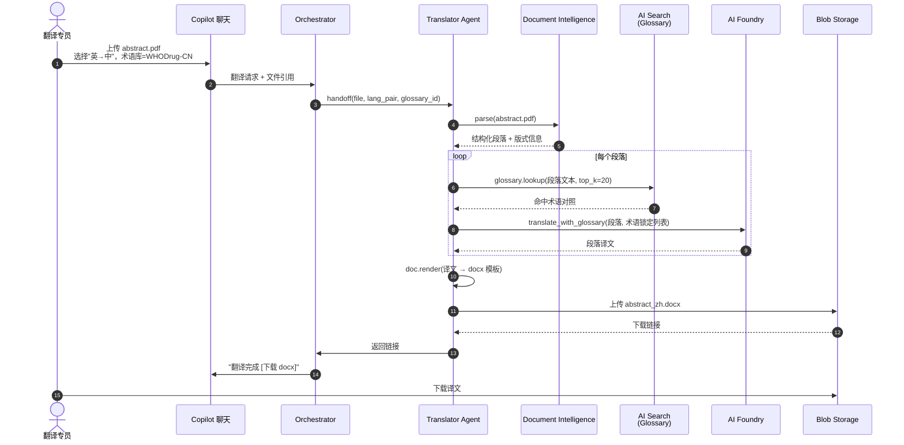
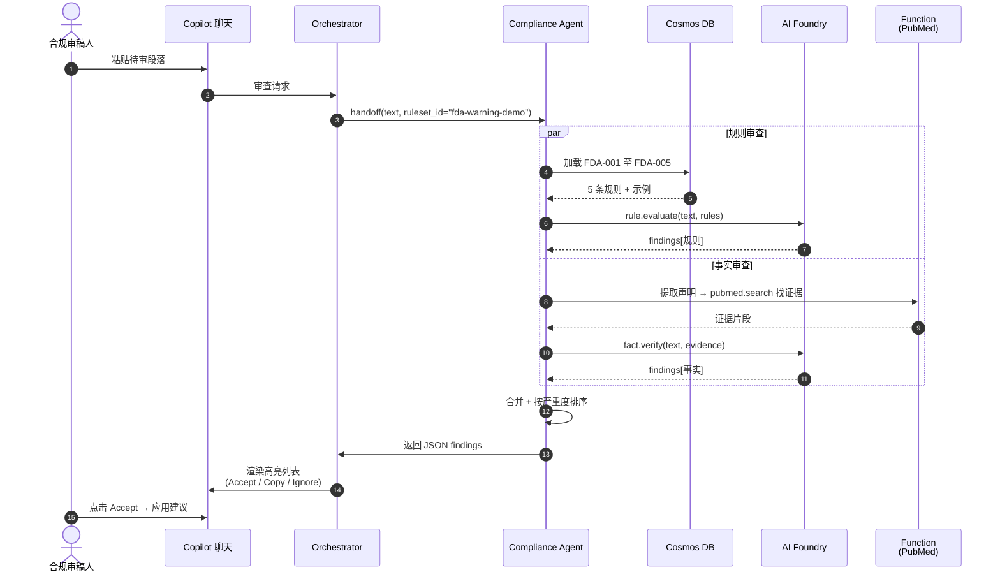
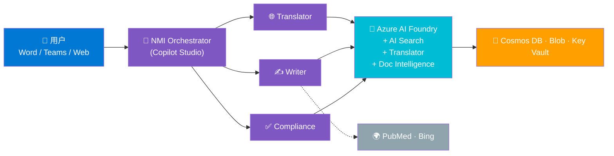

# NMI on Microsoft — 端到端架构图

> **目标受众**：客户决策层 / 管理层 / 解决方案架构师
> **配套文件**：[../PRD-NMI-Copilot-Studio-Demo.md](../PRD-NMI-Copilot-Studio-Demo.md)

---

## 1. 一页纸全局架构图（推荐用于演示收尾）

---

## 2. 用户旅程图：场景 A（Word 内生成段落）

---

## 3. 用户旅程图：场景 B（PDF 翻译 + 术语锁定）

---

## 4. 用户旅程图：场景 C（合规审查 — 规则 + 事实并行）

---

## 5. 简化版（用于 PPT 单页）

---

## 6. 如何使用本文件

- **VS Code 预览**：安装 "Markdown Preview Mermaid Support" 扩展，按 `Ctrl+Shift+V` 即可看图。
- **导出为 PNG/SVG**：使用 [https://mermaid.live](https://mermaid.live) 在线渲染 → 导出。
- **嵌入 PPT**：直接截图，或用 mermaid-cli (`mmdc`) 命令行导出 SVG。
- **嵌入 Word/Loop**：粘贴 PNG 图片即可。
